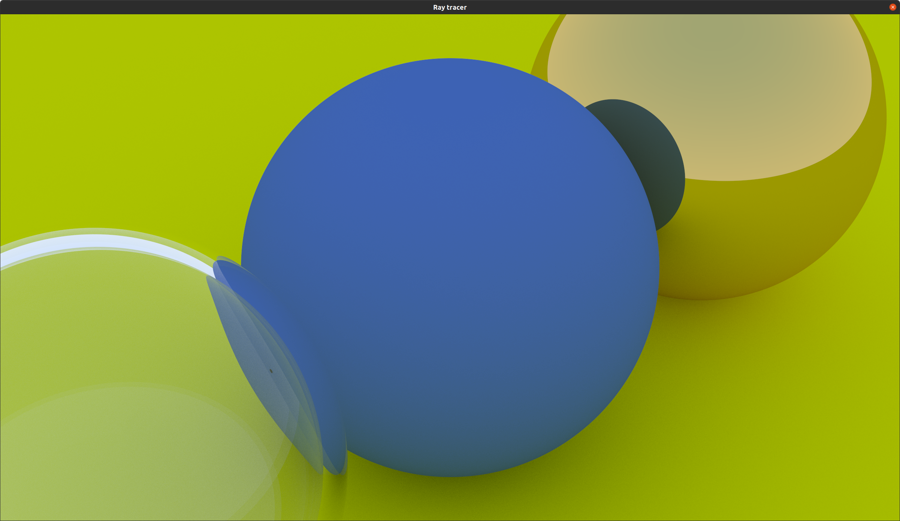

A ray tracer written in Rust, based on [Peter Shirley's book](https://raytracing.github.io/books/RayTracingInOneWeekend.html). As an improvement, I used the [`rayon`](https://crates.io/crates/rayon) crate to parallelize the code.

```bash
$ git clone https://github.com/fdebellabre/ray-tracer && cd ray-tracer
$ cargo run
```

